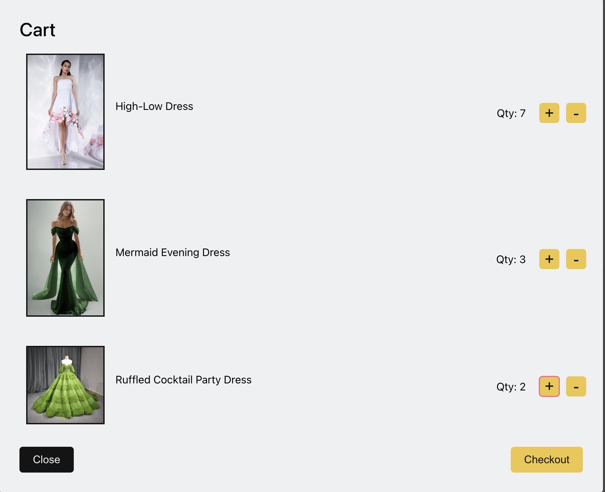
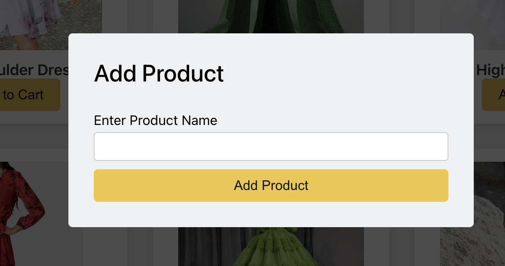

# 🛍️ Aurelle - E-commerce Web App

A sleek and minimalistic e-commerce platform built with **React**, featuring a shopping cart, product addition functionality, and a modern UI.

## 🚀 Features
- **🛒 Shopping Cart:** Add, remove, and update product quantities seamlessly.
- **➕ Add Product:** Users can add their own products dynamically.
- **📦 Product Management:** Displays all available products with an intuitive interface.
- **🖥️ Modal Implementation:** Used for the "Add Product" form.
- **🔄 State Management:** Efficiently handled with `useState`.
- **🔗 React Portals:** Used for rendering the modal outside the root div.
- **⚡ Performance Optimized:** Uses React Fragments to avoid unnecessary div wrappers.

---

## 📸 UI Screenshots
### 1️⃣ Homepage
*Showcase of products available for purchase.*


### 2️⃣ Shopping Cart
*Displays items added to the cart with options to increase, decrease quantity, or remove items.*


### 3️⃣ Add Product Modal
*Form for adding a new product with input validation and state handling.*


### 4️⃣ Updated Product List
*Newly added products appear dynamically without a page refresh.*

---

## 🛠️ Tech Stack
- **React** - Component-based UI
- **useState Hook** - State management for UI updates
- **React Fragments** - Prevents unnecessary div wrappers
- **React Portals** - Renders modals outside the main DOM hierarchy
- **Event Handling** - `event.preventDefault()` to handle form submission properly

---

## 📂 Project Structure
```
/src
  ├── components
  │   ├── Header
  │   ├── Products
  │   ├── Cart
  │   ├── AddProduct
  │   └── UI/Modal
  ├── data
  │   ├── products.json
  ├── App.js
  ├── index.js
  ├── styles
```

---

## 🔧 Installation & Setup
1️⃣ Clone the repository:
```bash
  git clone https://github.com/DeepaliSaini4/E-Commerce.git
```
2️⃣ Install dependencies:
```bash
  npm install
```
3️⃣ Start the development server:
```bash
  npm start
```

---

## 🎯 Key React Concepts Used
### 1️⃣ **State Management (`useState`)**
- Tracks cart items, product list, and modal visibility.

### 2️⃣ **Event Handling**
- `onClick` for button actions and `onChange` for form inputs.

### 3️⃣ **React Fragments**
- `<></>` used to avoid unnecessary extra divs.

### 4️⃣ **React Portals**
- Used to render the modal (`Modal.js`) outside the root div for better accessibility and styling control.

### 5️⃣ **Props Drilling**
- Functions passed from parent components to child components for updating states.

### 6️⃣ **Component-Based Architecture**
- Each feature is modularized into separate components.

---

## 📌 Future Enhancements
- ✅ Implement Local Storage for cart persistence.
- ✅ Add product categories and filtering options.
- ✅ Improve UI with animations and better styling.
- ✅ Implement backend integration for database storage.

---

## 📝 Contributing
Feel free to fork the repo, create a branch, and submit a PR. Contributions are welcome!

---

## 📜 License
MIT License. Free to use and modify!

